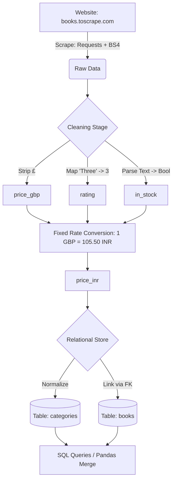

# Data Pipeline - Book Scraper & Relational Store (Module 1)

## Overview
This module implements a complete data engineering pipeline that scrapes product data from a public practice site, cleans and transforms the data, and stores it in a normalized SQLite relational database. This represents the "raw-to-relational" workflow required for catalog and competitive intelligence tasks.



## Design Decisions


### 1. Scraping Strategy
- **Source**: `books.toscrape.com` — a public site for scraping practice.
- **Scope**: Scraped 4 categories (Travel, Mystery, Historical Fiction, Science Fiction) to ensure a diverse dataset.
- **Volume**: Captured 85 books, exceeding the minimum requirement of 60.
- **Robustness**: Implemented `User-Agent` headers and `time.sleep` to be respectful to the server and avoid blocking.

### 2. Data Cleaning & Parsing
- **Encoding**: Forced `utf-8` encoding on requests to ensure currency symbols and special characters are decoded correctly.
- **Price**: Used regex `[^\d.]` to strip all non-numeric characters from price strings and converted to float (`price_gbp`).
- **Rating**: Mapped textual ratings (e.g., "Three") to integers (1-5).
- **Availability**: Parsed the availability text into a boolean `in_stock` column.
- **Missing Values**:
    - **Scraper Drops**: Listings missing required tags (title, price, rating, or availability) are skipped during scraping to ensure the final dataset contains only complete records.
    - **Imputation**: Implemented **median imputation** for numeric fields (`price_gbp` and `rating`).
    - **Justification**: Median imputation was chosen over dropping rows to maintain the dataset size and ensure the final count remained above the 60-book threshold, while remaining robust against potential outliers that would skew a mean imputation.

### 3. Currency Conversion
As per project requirements, a fixed baseline conversion rate was used to compute the `price_inr` column:
**1 GBP = 105.50 INR**

### 4. Database Schema
Implemented a normalized two-table schema to avoid data redundancy and enforce relational integrity:
- **`categories` Table**: `category_id` (PRIMARY KEY), `category_name` (UNIQUE).
- **`books` Table**: `book_id` (PRIMARY KEY), `title`, `price_gbp`, `price_inr`, `rating`, `in_stock`, `category_id` (FOREIGN KEY referencing `categories`).

## Implementation Details
- **SQL Execution**: The pipeline demonstrates a variety of SQL operations including `SELECT`, `WHERE`, `ORDER BY`, `LIMIT`, `DISTINCT`, and `JOIN` to extract insights from the normalized store.
- **Pandas Integration**: Validated the SQL JOIN results by reproducing the same output using `pd.merge` on in-memory DataFrames, ensuring consistency between the database and analysis layer.

## Installation & Execution
1. **Dependencies**:
   ```bash
   pip install requests beautifulsoup4 pandas
   ```
2. **Run**:
   Execute `BookVault_Data_Analytics.ipynb` from top to bottom. The notebook will:
   - Scrape the data.
   - Perform cleaning and conversion.
   - Create `booksdatabase.db`.
   - Execute the 5+ required SQL queries.
   - Compare SQL results with Pandas merge results.
